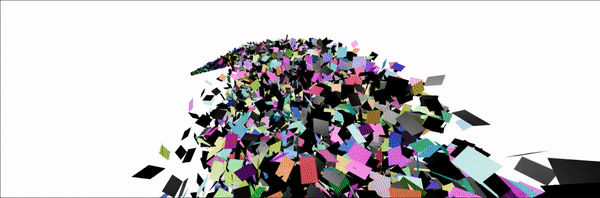

# Three.js Visualizations

This Github repo explores three.js visualizations. 

The purpose is to experiment with particle physics, 3D graphics, or fluids - as a foundation for AR installation art pieces I am currently working on.

The project uses React Three Fiber as a framework for rendering three.js in state. 

Here is the deployed Netlify link for testing: https://cocky-bohr-12bc5b.netlify.app/
